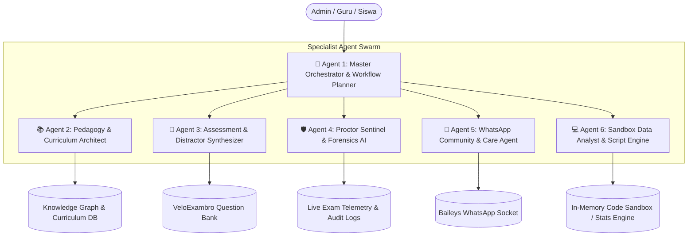
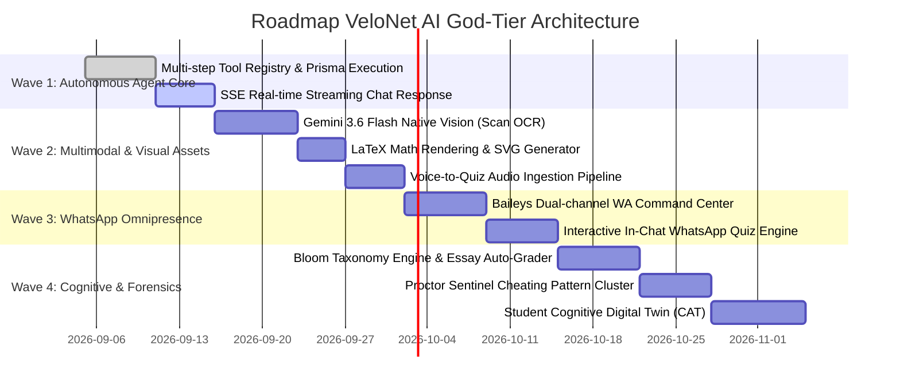

# Master Blueprint: VeloNet "God-Tier" Autonomous AI Engine & Multi-Agent Operating System
*(Arsitektur Sistem Kecerdasan Buatan Otonom Multi-Agent untuk LMS, CBT VeloExambro & WhatsApp Automation)*

---

## 1. Paradigma: Dari "AI Copilot Pasif" Menjadi "Autonomous LMS Operating System"

Sistem asisten AI konvensional hanya menunggu perintah dan merespons teks dalam satu giliran (*single-turn passive bot*). Pada tingkat **"God-Tier / Ultra-Overpower"**, AI VeloNet bertransformasi menjadi **Autonomous Educational Operating System (Sistem Operasi Pendidikan Otonom)** yang bekerja proaktif, memiliki memori jangka panjang adaptif, mengorkestrasi dewan agen AI spesialis, dan mengontrol seluruh ekosistem aplikasi secara terpadu.

```
┌───────────────────────────────────────────────────────────────────────────────────┐
│                           VELONET AI AGENTIC ECOSYSTEM                            │
│                                                                                   │
│   ┌───────────────┐     ┌───────────────────────────────────┐     ┌───────────┐   │
│   │  Omnichannel  │     │   Multi-Agent Swarm Orchestrator  │     │ Platform  │   │
│   │   Ingestion   │     │      (Gemini 3.6 Flash / Pro)     │     │ Execution │   │
│   ├───────────────┤     ├───────────────────────────────────┤     ├───────────┤   │
│   │ • Web Chat    │ ──> │ 1. Architect & Workflow Planner   │ ──> │ • Prisma  │   │
│   │ • WhatsApp WA │     │ 2. Pedagogy & Curriculum Agent    │     │ • CBT Eng │   │
│   │ • Scanned PDF │     │ 3. Assessment & Distractor Agent  │     │ • Baileys │   │
│   │ • Voice Audio │     │ 4. Proctor & Forensic Sentinel    │     │ • Code    │   │
│   │ • CSV / Excel │     │ 5. WhatsApp Nudge & Care Agent    │     │   Sandbox │   │
│   └───────────────┘     └───────────────────────────────────┘     └───────────┘   │
│                                           │                                       │
│                                           ▼                                       │
│                       ┌───────────────────────────────────────┐                   │
│                       │   Hybrid Knowledge Graph & Student    │                   │
│                       │    Cognitive Digital Twin Memory      │                   │
│                       └───────────────────────────────────────┘                   │
└───────────────────────────────────────────────────────────────────────────────────┘
```

---

## 2. Multi-Agent Swarm Hierarchy (Dewan Agen AI Spesialis)

Satu model tunggal tidak dapat menyelesaikan tugas kurikulum, forensik ujian, dan broadcast WhatsApp sekaligus dengan kualitas tertinggi. VeloNet mengadopsi pola **Hierarchical Multi-Agent Swarm**:



### Rincian Peran Masing-Masing Sub-Agent:

| Nama Agen | Model Basis | Domain Tugas Utama |
| :--- | :--- | :--- |
| **1. Master Orchestrator** | Gemini 3.6 Flash / Thinking | Membedah instruksi admin yang rumit, menyusun rencana aksi multi-langkah (*DAG Plan*), mendelegasikan tugas ke sub-agent, dan merangkum hasil akhir. |
| **2. Pedagogy Architect** | Gemini 3.6 Flash | Memetakan silabus, mengaitkan materi dengan **Taksonomi Bloom (C1-C6)**, menyusun rubrik essay analitis, dan memastikan standar kompetensi tercapai. |
| **3. Assessment Synthesizer** | Gemini 3.6 Flash (JSON Strict) | Memproduksi 5 variasi soal CBT, memvalidasi opsi pengecoh (*plausible distractors*), mengonversi rumus ke $\LaTeX$, dan men-generate diagram SVG teknis. |
| **4. Proctor Sentinel** | Real-time Rule + AI Heuristic | Mengawasi telemetri ujian VeloExambro live, mendeteksi bot clicker, anomali pergantian tab berulang, dan kesamaan jawaban antar-peserta (*plagiarism graph*). |
| **5. WhatsApp Care Agent** | Gemini 3.6 Flash + Baileys | Menjalankan *AI Nudging*: mengirimkan pengingat tugas ramah yang dipersonalisasi sesuai kebiasaan jam aktif siswa, serta menjawab pertanyaan tutor 24/7. |
| **6. Sandbox Data Analyst** | Node.js Worker Sandbox | Mengeksekusi kalkulasi statistik rumit, membaca file Excel/CSV absensi puluhan ribu baris, dan menghasilkan grafik analitik performa kelas. |

---

## 3. Deep Multimodal Ingestion & Generator Aset Visual Ilmiah

### A. Computer Vision untuk Soal Bergambar & Scan Fisik
Banyak dokumen guru di lapangan berupa:
1. Lembar fotokopi ujian lama yang difoto menggunakan kamera ponsel dengan pencahayaan tidak merata.
2. Soal dengan gambar grafik kartesius, diagram rangkaian listrik, atau bagan sel biologi.

**Mekanisme Ingestion:**
- Mengirim buffer berkas langsung ke API Multimodal Gemini 3.6 Flash.
- Model mengenali letak teks soal dan mendeskripsikan gambar/diagram secara presisi.
- AI otomatis mengisolasi gambar diagram atau mereproduksinya kembali dalam format **SVG murni** atau diagram **Mermaid** yang tajam di semua resolusi layar HP.

### B. Math & Formula Engine ($\LaTeX$ / KaTeX)
- Soal matematika, fisika, dan kimia otomatis diformat dengan sintaks KaTeX:
  - Rumus kuadratik: `\(x = \frac{-b \pm \sqrt{b^2 - 4ac}}{2a}\)`
  - Reaksi kimia: `\(\text{H}_2\text{SO}_4 + 2\text{NaOH} \rightarrow \text{Na}_2\text{SO}_4 + 2\text{H}_2\text{O}\)`
- Siswa dan guru dapat melihat rumus matematika secara elegan dan responsif di smartphone.

### C. Voice-to-Quiz (Transkripsi Suara Guru)
- Guru cukup menekan tombol mic di chat melayang atau mengirim *voice note* di WhatsApp:
  *"Halo bot, tolong buatkan 3 soal pilihan ganda tentang Hukum Ohm, dengan nilai hambatan 10 ohm dan tegangan 220 volt, tanyakan kuat arusnya."*
- Suara langsung ditranskripsi, dianalisis nilai parameternya, dan menghasilkan soal CBT lengkap beserta perhitungan dan pembahasannya.

---

## 4. WhatsApp Native Interactive Engine (Kuis Langsung di Chat WA)

Keunggulan terbesar VeloNet adalah integrasi langsung dengan WhatsApp via Baileys. AI tidak hanya mengirim tautan web, melainkan mampu **menjalankan kuis langsung di dalam chat WhatsApp**:

```
[WhatsApp Siswa] ──> "Kuis Harian"
                           │
                           ▼
             [VeloNet WhatsApp AI Agent]
                           │
                           ▼
[Pesan WA Siswa] <── "🧠 *Kuis Kilat Fisika #1*
                      Sebuah benda bermassa 2 kg ditarik gaya 10 N di lantai licin.
                      Berapakah percepatan benda tersebut?
                      
                      [A] 2 m/s²
                      [B] 5 m/s²
                      [C] 20 m/s²
                      [D] 0.5 m/s²
                      
                      _Balas langsung dengan huruf A, B, C, atau D!_"
                           │
                           ▼
[Siswa Balas WA] ──> "B"
                           │
                           ▼
[Pesan WA Siswa] <── "🎉 *JAWABAN BENAR!* (+15 XP)
                      Pembahasan: a = F / m = 10 N / 2 kg = 5 m/s².
                      Skor XP Anda sekarang: 450 XP (Peringkat #3 Kelas)."
```

### Keuntungan Kuis WhatsApp Native:
- Siswa yang kuota internetnya minim atau tidak bisa membuka browser tetap bisa mengikuti latihan harian.
- Nilai dan perolehan XP langsung tercatat otomatis di tabel database `QuizAttempt` dan `GamificationProfile` Prisma!

---

## 5. Student Cognitive Digital Twin (Pemetaan Kognitif Siswa 1-on-1)

Sistem AI VeloNet membangun **profil kognitif dinamis (*Digital Twin*)** untuk setiap siswa:

```mermaid
graph LR
    subgraph Data Sources
        Q[Hasil Kuis CBT]
        A[Presensi & Kehadiran GPS]
        W[Interaksi Chat WA Tutor]
        T[Kecepatan Menjawab Soal]
    end

    subgraph AI Cognitive Engine
        Data Sources --> CE[Cognitive Diagnostic Model]
        CE --> Radar[Peta Kekuatan & Kelemahan Topik]
        CE --> Risk[Indikator Early Warning Risiko Gagal]
    end

    subgraph Personalized Interventions
        Radar --> CAT[Computerized Adaptive Testing]
        Risk --> Nudge[Pesan Motivasi Personal WA]
        Radar --> Reco[Rekomendasi Modul Tambahan]
    end
```

### Fitur Kognitif:
1. **Peta Kelemahan Topik**: Guru dapat melihat ringkasan: *"Di kelas X-A, 68% siswa salah di soal Passive Voice tipe Continuous Tense."*
2. **Computerized Adaptive Testing (CAT)**:
   - Jika siswa menjawab soal nomor 1 dengan benar, soal nomor 2 otomatis dinaikkan ke tingkat kesulitan lebih tinggi.
   - Jika salah, sistem menyajikan soal pendukung untuk menguji konsep dasar.
3. **Early Warning System**:
   - Jika siswa absen 2 kali berturut-turut dan nilai kuis terakhir di bawah KKM, AI otomatis menyusun ringkasan risiko dan mengajukan draf pesan perhatian kepada mentor/wali kelas.

---

## 6. Proctor Sentinel & Forensic Anti-Cheat AI (Forensik Ujian VeloExambro)

Mengubah sistem CBT VeloExambro menjadi benteng ujian paling jujur tanpa memberatkan perangkat siswa:

### Mekanisme Forensik AI:
1. **Analisis Kecepatan Menjawab (Response Time Anomaly)**:
   - Soal bacaan panjang 300 kata yang dijawab benar dalam 1,5 detik terindikasi telah menerima bocoran kunci jawaban.
2. **Tab-Switch Anomaly Index**:
   - AI memetakan korelasi antara momen siswa keluar dari jendela browser dengan lonjakan jawaban benar berturut-turut.
3. **Plagiarism & Collusion Heatmap**:
   - Untuk soal essay, AI membandingkan kesamaan semantik dan kemiripan struktur kalimat (*Sentence Embedding Cosine Similarity*) antar seluruh siswa dalam satu ruangan ujian.
   - AI menghasilkan laporan investigasi visual: *"Siswa A dan Siswa B memiliki tingkat kemiripan kalimat essay 94.2% pada soal nomor 4."*

---

## 7. Autonomous Tool Registry (Koleksi Alat Eksekusi Otonom)

Agen AI dibekali dengan **VeloNet Master Tool Registry**:

```typescript
// Definisi Tool Registry untuk Gemini Function Calling
export const VELONET_TOOL_REGISTRY = [
  // 1. DATA DATABASE
  {
    name: "db_query",
    description: "Membaca data database VeloNet (User, MeetingSession, Attendance, Quiz, ViolationLog) dengan filter aman.",
    parameters: {
      type: "object",
      properties: {
        entity: { type: "string", enum: ["user", "quiz", "meetingSession", "attendance", "violationLog", "course"] },
        where: { type: "object", description: "Prisma where clause" },
        take: { type: "number", description: "Jumlah baris data (maks 50)" },
        orderBy: { type: "object", description: "Urutan pengurutan data" }
      },
      required: ["entity"]
    }
  },

  // 2. KONTROL UJIAN & CBT
  {
    name: "cbt_create_or_update_quiz",
    description: "Membuat kuis baru atau memperbarui kuis yang ada beserta seluruh soal multi-tipe dan rubrik essay.",
    parameters: {
      type: "object",
      properties: {
        quizId: { type: "string", description: "ID kuis jika ingin update, kosongkan jika baru" },
        title: { type: "string" },
        durationMinutes: { type: "number" },
        questions: {
          type: "array",
          items: {
            type: "object",
            properties: {
              type: { type: "string", enum: ["SINGLE_CHOICE", "CHECKBOXES", "TRUE_FALSE", "SHORT_ANSWER", "ESSAY"] },
              text: { type: "string" },
              points: { type: "number" },
              options: { type: "array", items: { type: "object", properties: { text: { type: "string" }, isCorrect: { type: "boolean" } } } },
              sampleAnswer: { type: "string" },
              gradingRubric: { type: "string" },
              bloomLevel: { type: "string", enum: ["C1", "C2", "C3", "C4", "C5", "C6"] }
            }
          }
        }
      },
      required: ["title", "questions"]
    }
  },

  // 3. WHATSAPP BROADCAST & NUDGE
  {
    name: "wa_send_message",
    description: "Mengirim pesan notifikasi atau pengingat WhatsApp ke peserta atau grup melalui socket Baileys.",
    parameters: {
      type: "object",
      properties: {
        recipientType: { type: "string", enum: ["individual", "group", "broadcast_absent"] },
        targetId: { type: "string", description: "Nomor HP atau ID Group WA" },
        messageContent: { type: "string" }
      },
      required: ["recipientType", "messageContent"]
    }
  },

  // 4. KOREKSI ESSAY OTOMATIS
  {
    name: "ai_grade_essay_batch",
    description: "Menilai seluruh jawaban essay siswa yang belum dikoreksi pada kuis tertentu dengan rubrik analitis.",
    parameters: {
      type: "object",
      properties: {
        quizId: { type: "string" },
        autoApproveAboveScore: { type: "number", description: "Ambang skor untuk langsung disetujui (opsional)" }
      },
      required: ["quizId"]
    }
  },

  // 5. PENELITIAN & VALIDASI FAKTA (WEB SEARCH)
  {
    name: "web_search_knowledge",
    description: "Mencari referensi kurikulum terbaru, data statistik resmi, atau artikel edukasi di internet.",
    parameters: {
      type: "object",
      properties: {
        query: { type: "string" }
      },
      required: ["query"]
    }
  }
];
```

---

## 8. RLTF (Reinforcement Learning from Teacher Feedback)

AI VeloNet tidak bersifat statis, melainkan semakin pintar seiring berjalannya waktu melalui mekanisme **RLTF**:

1. **Teacher Override Logging**:
   - Jika AI merekomendasikan nilai essay 7.0, namun guru mengubahnya (*override*) menjadi 8.5 dan menambahkan catatan *"Jawaban siswa menggunakan istilah alternatif yang sah"*, AI menyimpan pasangan data ini ke tabel `AIFeedbackLearning`.
2. **Style Tuning Guru**:
   - Jika guru sering mengubah soal pilihan ganda agar opsi pengecohnya lebih santai atau lebih berbasis studi kasus, AI secara otomatis menyesuaikan preferensi prompt (*System Persona Weighting*) untuk guru tersebut pada pembuatan kuis berikutnya.

---

## 9. Zero-Touch End-to-End Workflow (Studi Kasus Eksekusi Nyata)

### Skenario: *"Pekan Ujian Tengah Semester Tanpa Beban Lembur Guru"*

```
[Langkah 1: Ingestion Dokumen]
Guru mengunggah file "Modul_Bahasa_Inggris_Kelas_11.docx" ke Floating Chat dan mengetik:
"Jadwalkan kuis evaluasi 20 soal multi-format (C1-C5) untuk hari Jumat jam 08.00,
aktifkan VeloExambro, dan kirimkan pengumuman ke grup WA kelas."

[Langkah 2: Perencanaan Otonom Multi-Agent]
1. Master Orchestrator membedah perintah menjadi 4 tugas.
2. Pedagogy Agent menganalisis modul dan membagi proporsi kognitif:
   - 6 Soal Pilihan Ganda (C1-C2)
   - 5 Soal Checkbox Multi-Jawaban (C3-C4)
   - 4 Soal True/False (C2)
   - 3 Soal Isian Singkat (C1)
   - 2 Soal Essay Analitis (C5) lengkap dengan rubrik bobot.
3. Assessor Agent menyusun 20 butir soal beserta kunci jawaban.
4. Database Tool menyimpan kuis ke Prisma dengan PIN acak dan pengamanan Exambro.
5. WhatsApp Agent menyusun draf pesan pengumuman jadwal kuis.

[Langkah 3: Presentasi Kartu Interaktif]
Floating Chat menampilkan kartu visual:
"✅ Kuis 'Evaluasi Bahasa Inggris Kelas 11' (20 Soal) siap diterbitkan!"
Lengkap dengan tombol:
[🚀 Terbitkan & Kirim Broadcast WA Sekarang]   [✏️ Tinjau Butir Soal]

[Langkah 4: Evaluasi & Rapor Pasca-Ujian]
Setelah ujian selesai pada hari Jumat:
- AI otomatis mengoreksi 100% soal pilihan ganda, checkbox, dan isian.
- AI memberikan rekomendasi nilai untuk seluruh essay siswa.
- AI mengirimkan laporan ringkas ke guru: "100% siswa selesai ujian, 2 siswa terindikasi tab-switch berulang, rata-rata kelas 84.5."
```

---

## 10. Roadmap Implementasi Teknis Menuju "God-Tier"



---

## 11. Kesimpulan

Dokumen ini meletakkan pondasi teknik terkuat bagi VeloNet. Dengan mengimplementasikan arsitektur ini, VeloNet tidak hanya sekadar setara dengan LMS komersial ternama (Google Classroom, Canvas, atau Moodle), melainkan **melompat 5 tahun ke depan** menjadi pionir LMS berbasis **Autonomous Multi-Agent AI System** di Indonesia.
