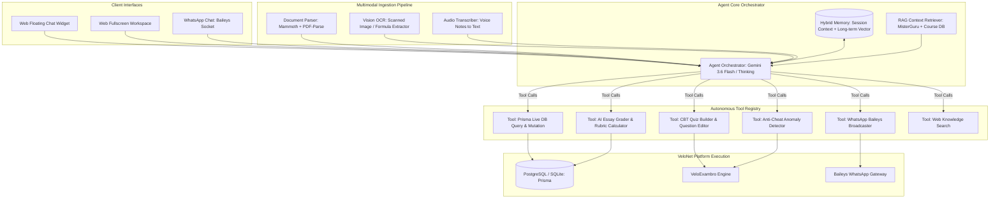
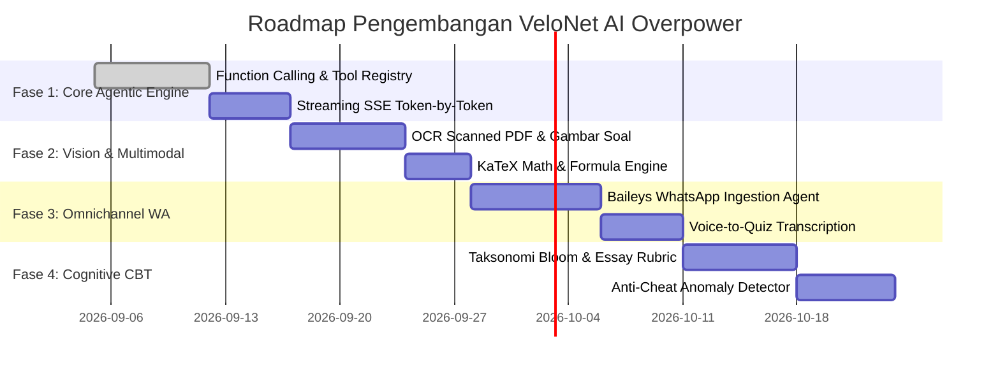

# Dokumen Spesifikasi Teknis: VeloNet Autonomous AI Copilot "Overpower"
*(Next-Generation Multi-Modal Agentic AI Engine for LMS, CBT & WhatsApp Automation)*

---

## 1. Ringkasan Eksekutif (Executive Summary)

Sistem AI yang ada saat ini di VeloNet telah mampu mengekstrak teks sederhana dan menghasilkan draf soal 1-shot secara statis. Namun, untuk mencapai level **"Overpower"**, AI VeloNet harus berevolusi dari sekadar *teks generator pasif* menjadi **Autonomous Multi-Modal Agent (Agen Cerdas Otonom Berkemampuan Penuh)**.

### Karakteristik Utama AI "Overpower":
1. **ReAct Agentic Loop & True Tool Calling**: Bot tidak hanya mengembalikan teks, melainkan dapat menjalankan rantai pemikiran (*Chain-of-Thought*) dan mengeksekusi aksi database (Prisma), kontrol bot WhatsApp (Baileys), pencarian web, serta manipulasi CBT secara otonom namun terkendali.
2. **Deep Multimodal Ingestion (Vision + Audio + OCR)**: Mampu membaca PDF hasil scan foto kamera HP, gambar diagram soal, persamaan matematika kompleks ($\LaTeX$ / KaTeX), tabel data nilai, hingga rekaman suara instruksi guru (*Voice-to-Quiz*).
3. **Dual-Channel Omnipresence (Web Dashboard & WhatsApp Command Center)**: Bot tidak hanya hidup di web floating chat, tetapi juga dapat dioperasikan langsung oleh Admin/Guru melalui chat WhatsApp (*"Bot, buatkan ujian 10 soal dari PDF yang baru saya kirim ini"*).
4. **Real-time Streaming (SSE) & Generative UI**: Balasan muncul instan per kata (streaming), langsung merender komponen antarmuka interaktif (*Interactive Quiz Editor*, *Live Attendance Charts*, *Approval Modals*).
5. **Cognitive Hybrid Grading & Anomaly Proctoring**: Penilaian essay otomatis berbasis taksonomi Bloom (C1-C6) dan analisis pola kecurangan siswa saat ujian CBT (deteksi anomali tab-switch dan clustering kecurangan).

---

## 2. Arsitektur Sistem & Diagram Alur (System Architecture)



---

## 3. Enam Pilar Kemampuan AI "Overpower"

### Pilar 1: Autonomous Agent Loop & Tool Calling (ReAct Framework)
AI tidak lagi dibatasi oleh template output tunggal, melainkan memiliki akses ke fungsi sistem (*Function Calling / Tools*):

```typescript
// Konsep Tool Registry yang dapat dipanggil AI secara mandiri:
const VELONET_AGENT_TOOLS = [
  {
    name: "query_database",
    description: "Membaca data statistik peserta, kuis, sesi absensi, atau pelanggaran ujian secara real-time.",
    parameters: { type: "object", properties: { entity: { type: "string" }, filter: { type: "object" } } }
  },
  {
    name: "batch_create_questions",
    description: "Menyimpan atau menambahkan puluhan soal multi-tipe langsung ke database kuis tertentu.",
    parameters: { type: "object", properties: { quizId: { type: "string" }, questions: { type: "array" } } }
  },
  {
    name: "send_whatsapp_announcement",
    description: "Mengirimkan pesan broadcast atau pengingat otomatis ke grup atau nomor peserta melalui Baileys.",
    parameters: { type: "object", properties: { target: { type: "string" }, message: { type: "string" } } }
  },
  {
    name: "trigger_student_strike_audit",
    description: "Menganalisis daftar siswa yang terkena strike/pelanggaran di ujian CBT dan memberikan rekomendasi sanksi.",
    parameters: { type: "object", properties: { quizId: { type: "string" } } }
  }
];
```

#### Alur Kerja Otonom:
1. **User Prompt**: *"Tolong carikan kuis yang paling baru dibuat, lalu tambahkan 5 soal essay tentang materi Narrative Text dari bank data, dan kirimkan notifikasi ke grup WA bahwa kuis sudah diperbarui."*
2. **AI Action 1**: Menjalankan `query_database({ entity: "quiz", sort: "desc", limit: 1 })`.
3. **AI Action 2**: Mengambil materi terkait dan merumuskan 5 soal essay lengkap dengan rubrik.
4. **AI Action 3**: Menjalankan `batch_create_questions({ quizId, questions })`.
5. **AI Action 4**: Menyiapkan kartu konfirmasi satu klik untuk eksekusi `send_whatsapp_announcement`.

---

### Pilar 2: Deep Multimodal OCR & Complex Formula Engine

Format materi di lapangan seringkali bukan teks rapi, melainkan:
* Foto lembar soal fisik yang difoto dengan kamera HP guru.
* Dokumen PDF hasil scan yang tidak memiliki lapisan teks (*scanned images*).
* Soal sains/matematika dengan simbol akar, pecahan, matriks ($\int, \sum, \frac{a}{b}$), atau diagram reaksi kimia.

#### Kemampuan yang Ditambahkan:
1. **Native Gemini Multimodal Vision**:
   - Jika PDF berupa scan gambar, halaman otomatis dikonversi ke gambar beresolusi tinggi dan dianalisis langsung oleh kemampuan Computer Vision Gemini 3.6 Flash.
2. **Auto-LaTeX & Markdown Formatter**:
   - Deteksi rumus matematika dan otomatis diformat ke blok KaTeX (`$...$` atau `$$...$$`) agar langsung dirender sempurna di antarmuka siswa VeloExambro.
3. **Voice Note to Quiz**:
   - Guru dapat merekam suara langsung di browser atau mengirim pesan suara (*voice note*) di WhatsApp. AI mentranskripsi dan merumuskan soal sesuai arahan lisan tersebut.

---

### Pilar 3: WhatsApp Command Center (Dual-Channel Integration)

Memanfaatkan integrasi Baileys WhatsApp yang sudah menjadi keunggulan VeloNet:

```
[Guru via WhatsApp] ──> "Halo Bot, buatkan kuis 5 soal pilihan ganda dari file PDF materi ini." + (Attach PDF)
                                      │
                                      ▼
                      [Baileys Socket Ingestion]
                                      │
                                      ▼
                     [VeloNet Agent Orchestrator]
                                      │
                                      ▼
[Bot WA Response] <── "✅ Berhasil! Draf kuis 'Bahasa Inggris Unit 4' (5 Soal) telah dibuat di VeloNet.
                       🔗 Klik link ini untuk verifikasi & terbitkan: https://velonet.../admin/exams/xyz"
```

#### Fitur WhatsApp AI:
* **Admin WhatsApp Command**: Admin/Guru dapat mengontrol sistem tanpa membuka laptop.
* **Student AI Tutor 24/7**: Siswa dapat berdiskusi materi dengan bot di nomor WhatsApp resmi VeloNet di luar jam kelas, dengan batasan ketat (*guardrail*) agar bot tidak membocorkan jawaban kuis aktif.

---

### Pilar 4: Real-time Streaming (SSE) & Generative UI

Masalah utama antarmuka AI lambat adalah pengguna harus menunggu 10-15 detik di depan layar kosong.

#### Arsitektur Streaming Generative UI:
1. **Server-Sent Events (SSE)**: Respons AI ditransmisikan secara *streaming* token-per-token. Pengguna langsung melihat teks mengalir dalam 300 milidetik pertama.
2. **Interactive Generative Cards**:
   - **Live Question Editor**: Soal hasil generate AI langsung berupa kartu interaktif yang bisa diedit teksnya, dipindah urutannya (*drag and drop*), atau diubah opsi kunci jawabannya sebelum diterbitkan.
   - **Live Data Visualizer**: Jika admin menanyakan kehadiran, AI menampilkan grafik visual batang/lingkaran secara langsung di dalam balon chat.

---

### Pilar 5: Cognitive Grading Berbasis Taksonomi Bloom

Penilaian tidak hanya benar/salah, melainkan analisis kemampuan kognitif siswa:

| Tingkat Kognitif (Bloom) | Tipe Soal yang Dirancang AI | Logika Evaluasi AI |
| :--- | :--- | :--- |
| **C1 - Mengingat** | Isian Singkat / Single Choice | Pencocokan istilah & sinonim kunci |
| **C2 - Memahami** | True/False & Pilihan Ganda Naratif | Pengenalan konsep & parafrase kalimat |
| **C3 - Menerapkan** | Studi Kasus Singkat (Short Answer) | Penerapan rumus atau aturan tata bahasa |
| **C4 - Menganalisis** | Checkboxes Multi-Jawaban | Identifikasi kesalahan kalimat & relasi premis |
| **C5 - Mengevaluasi** | Essay Berbobot (Analytical) | Rubrik berbasis argumen, bukti, dan logika |
| **C6 - Mencipta** | Essay Konstruktif / Pemecahan Masalah | Originalitas ide dan koherensi solusi |

#### Anti-Cheat Anomaly Clustering:
AI dapat membaca log `ExamViolationLog` dari VeloExambro dan menghasilkan laporan investigasi:
- Menghitung rasio pergantian tab per menit.
- Mendeteksi kesamaan jawaban essay antar peserta (*Plagiarism Heatmap*).
- Menandai peserta yang mencurigakan secara otomatis (*Flagged Candidates*).

---

### Pilar 6: RAG (Retrieval-Augmented Generation) & Knowledge Memory

Agar AI tidak berhalusinasi dan selalu relevan dengan kurikulum Velocity:
1. **Vector Embeddings untuk Modul & Silabus**:
   - Setiap artikel di `ScrapedArticle`, modul kursus di `Course`, dan riwayat soal disimpan dalam representasi vektor.
   - Saat admin membuat instruksi, sistem melakukan pencarian semantik (*Cosine Similarity*) untuk menyuntikkan bab buku atau modul yang paling tepat.
2. **Persistent Conversation Memory**:
   - AI mengingat konteks percakapan lintas sesi dan preferensi guru (misal: gaya bahasa soal, tingkat kesulitan kelas).

---

## 4. Rencana Implementasi Bertahap (Roadmap)



---

## 5. Ringkasan Keunggulan Kompetitif

Dengan menerapkan arsitektur dalam dokumen ini:
* **Kecepatan Guru Naik 10x**: Guru cukup mengirim file modul/foto buku ke bot, dan dalam hitungan detik kuis CBT multi-format siap diujikan di VeloExambro.
* **Operasional Admin Tanpa Klik Rumit**: Cukup ketik instruksi di Floating Chat atau WhatsApp, tugas-tugas database (tambah soal, broadcast, cek kehadiran) selesai secara otomatis.
* **Standar Mutu Ujian Setara Sertifikasi Internasional**: Soal memiliki variasi kognitif mendalam (bukan sekadar hafalan dangkal), dilengkapi rubrik penilaian otomatis berbasis kecerdasan buatan.
