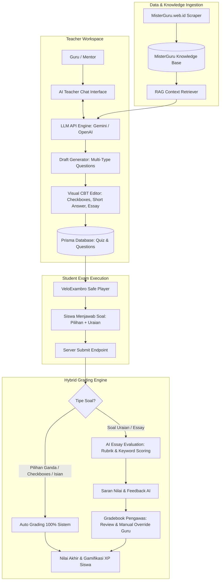

# Dokumen Spesifikasi Teknis: AI Teacher Assistant & Multi-Format CBT System

## 1. Ringkasan Eksekutif (Executive Summary)

Dokumen ini mendefinisikan arsitektur dan spesifikasi teknis untuk pengembangan **AI Teacher Assistant (Asisten AI Khusus Guru)** dan **Sistem Ujian CBT Multi-Format dengan Penilaian Uraian Cerdas (Hybrid AI-Teacher Grading)** pada platform **VeloNet LMS**.

### Pilar Utama Sistem:
1. **Teacher-Exclusive AI Chat Copilot**: Asisten cerdas berbasis obrolan (*Chat Interface*) khusus bagi Guru/Mentor untuk berkonsultasi materi, menyusun silabus, merancang draf soal ujian, serta menganalisis hasil belajar siswa menggunakan API Model khusus (OpenAI / Gemini API).
2. **MisterGuru as RAG Knowledge Base**: Data hasil scraping dari *MisterGuru.web.id* dialihfungsikan menjadi **Bank Pengetahuan & Konteks Edukasi (Knowledge Base)** yang dipelajari dan diserap oleh Asisten AI untuk memproduksi soal-soal berkualitas tinggi dan kontekstual.
3. **Multi-Type Question Engine (Google Forms Paradigm)**: Mendukung variasi soal lengkap tidak hanya pilihan ganda biasa:
   - `SINGLE_CHOICE` (Pilihan Ganda 1 Opsi)
   - `CHECKBOXES` (Pilihan Ganda Banyak Jawaban Benar)
   - `TRUE_FALSE` (Benar / Salah)
   - `SHORT_ANSWER` (Isian Singkat)
   - `ESSAY` (Uraian Panjang / Jawaban Terbuka)
4. **Hybrid Essay Auto-Grading & Rubric Engine**: Penilaian otomatis untuk soal objektif, dan **rekomendasi pembobotan nilai otomatis berbasis AI** untuk soal uraian/essay yang dapat ditinjau, disetujui, atau disesuaikan secara manual oleh guru (*Teacher Override*).

---

## 2. Diagram Alur & Arsitektur Sistem (System Architecture)



---

## 3. Desain Skema Database (Prisma Schema)

Untuk mendukung percakapan asisten guru, tipe soal multi-format, dan penilaian uraian berbobot, skema Prisma diperluas sebagai berikut:

```prisma
// ==========================================
// 1. TIPE SOAL & KONFIGURASI KUIS
// ==========================================

enum QuestionType {
  SINGLE_CHOICE  // Pilihan Ganda 1 Opsi
  CHECKBOXES     // Pilihan Ganda Banyak Opsi Benar
  TRUE_FALSE     // Benar / Salah
  SHORT_ANSWER   // Isian Singkat
  ESSAY          // Soal Uraian Terbuka
}

model Quiz {
  id                    String       @id @default(uuid())
  title                 String
  description           String?
  
  // Pengaturan Keamanan VeloExambro
  durationMinutes       Int          @default(30)
  enableFullscreenLock  Boolean      @default(true)
  enableTabSwitchDetect Boolean      @default(true)
  maxStrikes            Int          @default(3)
  enableCameraProctor   Boolean      @default(true)
  supervisorPin         String       @default("123456")
  shuffleQuestions      Boolean      @default(true)
  shuffleOptions        Boolean      @default(true)

  questions             Question[]
  attempts              QuizAttempt[]

  createdAt             DateTime     @default(now())
  updatedAt             DateTime     @updatedAt
}

model Question {
  id                    String        @id @default(uuid())
  quizId                String
  quiz                  Quiz          @relation(fields: [quizId], references: [id], onDelete: Cascade)
  
  type                  QuestionType  @default(SINGLE_CHOICE)
  text                  String        // Teks pertanyaan / narasi bacaan
  points                Int           @default(10) // Bobot poin maksimal
  order                 Int           @default(0)
  
  // Panduan Rubrik Penilaian untuk Soal Uraian (ESSAY / SHORT_ANSWER)
  sampleAnswer          String?       // Contoh jawaban ideal
  gradingRubric         String?       // Kriteria kata kunci wajib & bobot penilaian (JSON string / Markdown)
  caseSensitive         Boolean       @default(false) // Untuk SHORT_ANSWER

  options               Option[]
  studentAnswers        QuizStudentAnswer[]

  createdAt             DateTime      @default(now())
  updatedAt             DateTime      @updatedAt
}

model Option {
  id                    String        @id @default(uuid())
  questionId            String
  question              Question      @relation(fields: [questionId], references: [id], onDelete: Cascade)
  text                  String
  isCorrect             Boolean       @default(false) // True jika opsi ini salah satu jawaban benar
}

// ==========================================
// 2. REKAM JEJAK PENGERJAAN & PENILAIAN SISWA
// ==========================================

model QuizAttempt {
  id                    String               @id @default(uuid())
  quizId                String
  quiz                  Quiz                 @relation(fields: [quizId], references: [id], onDelete: Cascade)
  userId                String
  user                  User                 @relation(fields: [userId], references: [id], onDelete: Cascade)
  
  status                String               @default("IN_PROGRESS") // IN_PROGRESS, LOCKED, SUBMITTED, GRADED, DISQUALIFIED
  strikeCount           Int                  @default(0)
  score                 Float                @default(0) // Skor total yang diperoleh
  totalScore            Float                @default(0) // Skor maksimal yang bisa didapat
  
  isFullyGraded         Boolean              @default(false) // True jika seluruh essay sudah dinilai guru
  
  startedAt             DateTime             @default(now())
  submittedAt           DateTime?
  gradedAt              DateTime?

  answers               QuizStudentAnswer[]
  violations            ExamViolationLog[]

  createdAt             DateTime             @default(now())
  updatedAt             DateTime             @updatedAt

  @@unique([quizId, userId])
}

model QuizStudentAnswer {
  id                    String        @id @default(uuid())
  attemptId             String
  attempt               QuizAttempt   @relation(fields: [attemptId], references: [id], onDelete: Cascade)
  questionId            String
  question              Question      @relation(fields: [questionId], references: [id], onDelete: Cascade)
  
  // Respon Siswa
  selectedOptionIds     String?       // JSON Array string untuk SINGLE_CHOICE / CHECKBOXES (misal: ["opt-1", "opt-3"])
  textResponse          String?       // Jawaban teks untuk SHORT_ANSWER atau ESSAY
  
  // Sistem Penilaian Hybrid
  isAutoGraded          Boolean       @default(false)
  earnedPoints          Float         @default(0)
  
  // Penilaian AI untuk Essay
  aiSuggestedScore      Float?        // Skor rekomendasi AI (0 - points)
  aiEvaluationFeedback  String?       // Analisis & feedback evaluasi AI
  
  // Penilaian Manual Guru (Teacher Override)
  teacherScore          Float?
  teacherFeedback       String?
  gradedByUserId        String?

  createdAt             DateTime      @default(now())
  updatedAt             DateTime      @updatedAt

  @@unique([attemptId, questionId])
}

// ==========================================
// 3. RIWAYAT PERCAKAPAN ASISTEN AI GURU
// ==========================================

model AIChatSession {
  id                    String           @id @default(uuid())
  userId                String           // ID Guru / Admin
  title                 String           @default("Sesi Diskusi Baru")
  contextTopicId        String?          // Relasi opsional ke artikel Knowledge Base
  
  messages              AIChatMessage[]

  createdAt             DateTime         @default(now())
  updatedAt             DateTime         @updatedAt
}

model AIChatMessage {
  id                    String           @id @default(uuid())
  sessionId             String
  session               AIChatSession    @relation(fields: [sessionId], references: [id], onDelete: Cascade)
  
  role                  String           // "user" (Guru) atau "assistant" (AI)
  content               String           // Isi pesan / balasan
  generatedQuizDraft    String?          // JSON payload draf soal jika AI men-generate kuis
  
  createdAt             DateTime         @default(now())
}
```

---

## 4. Rincian Fitur & Alur Kerja

### 4.1 Asisten AI Khusus Guru (AI Chat Copilot)
- **Akses**: Hanya dapat diakses oleh akun dengan peran `MENTOR` atau `ADMIN` di `/admin/ai-assistant`.
- **Fitur Chat Interaktif**:
  - Guru dapat mengobrol santai seperti dengan asisten ahli kurikulum.
  - *Prompt Contoh*:
    - *"Tolong buatkan 5 soal pilihan ganda, 3 soal checkboxes, dan 2 soal uraian tentang materi Degrees of Comparison dari database MisterGuru dengan tingkat kesulitan Intermediate."*
    - *"Perbaiki soal nomor 2 agar opsi pengecohnya lebih menantang."*
    - *"Buatkan rubrik penilaian untuk soal uraian tentang narrative text."*
- **Koneksi RAG ke Database MisterGuru**:
  - Saat guru menyebutkan materi tertentu (atau memilih tombol lampiran materi), sistem mengambil konten teks lengkap dari `ScrapedArticle` dan menyuntikkannya sebagai *System Context* pada panggilan model LLM.

---

### 4.2 Multi-Type Question Player (Tampilan Siswa di VeloExambro)
Sesuai aturan mobile-first di `AGENTS.md`, antarmuka pengerjaan soal di `/student/quiz/[id]` beradaptasi secara dinamis sesuai tipe soal:

| Tipe Soal | Komponen Input di Layar Siswa | Logika Penilaian Otomatis |
| :--- | :--- | :--- |
| **SINGLE_CHOICE** | Radio button A, B, C, D (Pilih 1) | Otomatis: Poin penuh jika benar, 0 jika salah. |
| **CHECKBOXES** | Checkbox kotak centang (Bisa pilih $\ge 1$) | Otomatis: Sistem pembobotan parsial (*Partial Credit*) atau semua opsi benar harus tercentang. |
| **TRUE_FALSE** | Dua tombol besar: **BENAR** / **SALAH** | Otomatis: Poin penuh jika sesuai. |
| **SHORT_ANSWER** | Kolom input teks 1 baris | Otomatis: Pencocokan string teks (dengan opsi *case-sensitive*). |
| **ESSAY (Uraian)** | Textarea multi-baris dengan indikator jumlah kata | **Hybrid AI-Teacher**: Disimpan untuk diproses auto-grading AI dan verifikasi guru. |

---

### 4.3 Mesin Penilaian Uraian Cerdas (AI Essay Auto-Grading & Rubric Engine)

#### Cara Kerja Penilaian Uraian:
1. **Penyerahan Jawaban Siswa**: Siswa mengirimkan jawaban uraian pada kuis.
2. **Evaluasi Awal oleh AI**:
   - Backend memanggil modul AI Evaluator dengan parameter:
     - Pertanyaan Soal
     - Contoh Jawaban Ideal (`sampleAnswer`)
     - Rubrik Penilaian & Kriteria Kata Kunci (`gradingRubric`)
     - Jawaban Siswa (`textResponse`)
     - Poin Maksimal Soal
   - AI menghasilkan:
     - `aiSuggestedScore`: Skor angka (misal: 8.5 dari 10).
     - `aiEvaluationFeedback`: Penjelasan kekuatan jawaban siswa dan aspek yang kurang lengkap.
3. **Buku Nilai Guru (Teacher Gradebook)**:
   - Guru membuka dashboard penilaian di `/admin/exams/[id]/grading`.
   - Guru melihat jawaban siswa berdampingan dengan saran nilai dan feedback dari AI.
   - Guru dapat menerima saran AI dengan 1-klik (*"Approve AI Score"*) atau memasukkan nilai manual sendiri (*"Override Score"*).

---

## 5. Rencana Endpoint API Baru

```
POST /api/admin/ai/chat/session         -> Buat sesi percakapan baru guru-AI
POST /api/admin/ai/chat/message         -> Kirim pesan guru & dapatkan balasan AI + Draf Kuis
GET  /api/admin/ai/chat/history         -> Ambil riwayat percakapan guru

POST /api/admin/quiz/create-multi       -> Simpan kuis multi-tipe (Single, Checkbox, Short, Essay)
GET  /api/admin/exams/[id]/grading      -> Ambil daftar jawaban uraian siswa yang perlu dinilai
POST /api/admin/exams/[id]/grade-essay  -> Simpan nilai final uraian siswa oleh guru
```

---

## 6. Estimasi Beban Kerja & Skala Kode

Implementasi penuh sistem ini diperkirakan mencakup **~3.500 - 5.000 baris kode** terstruktur yang terdiri dari:
1. **Prisma Schema & Database Migrations**: ~300 baris
2. **AI Chat & RAG Engine (`ai-teacher-chat.ts`, `ai-essay-grader.ts`)**: ~900 baris
3. **API Route Handlers (Chat, Multi-Format Quiz, Grading)**: ~1.000 baris
4. **Antarmuka Chat Asisten Guru (`/admin/ai-assistant`)**: ~800 baris
5. **Pembaruan Komponen Player Siswa (5 Tipe Soal)**: ~700 baris
6. **Dashboard Penilaian Uraian Guru (`/admin/exams/[id]/grading`)**: ~800 baris

---

## 7. Kesimpulan & Langkah Selanjutnya
Rancangan arsitektur ini mengubah VeloNet menjadi **LMS Cerdas Kelas Atas** yang menggabungkan kemudahan pembuatan soal berbantuan AI, kekayaan bank materi MisterGuru, fleksibilitas tipe soal setara Google Forms, serta kecepatan koreksi soal uraian dengan bantuan kecerdasan buatan.
