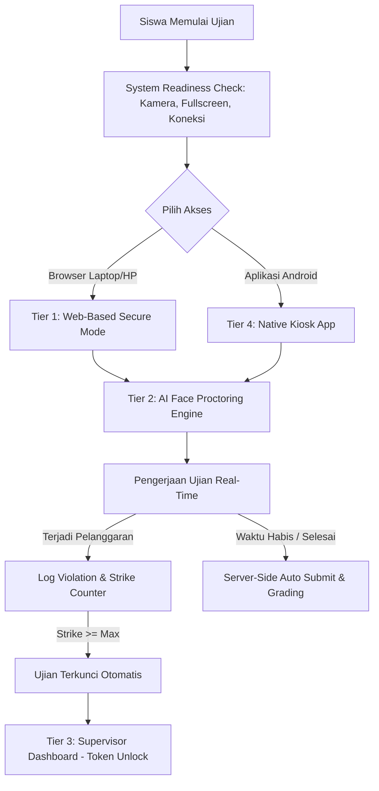
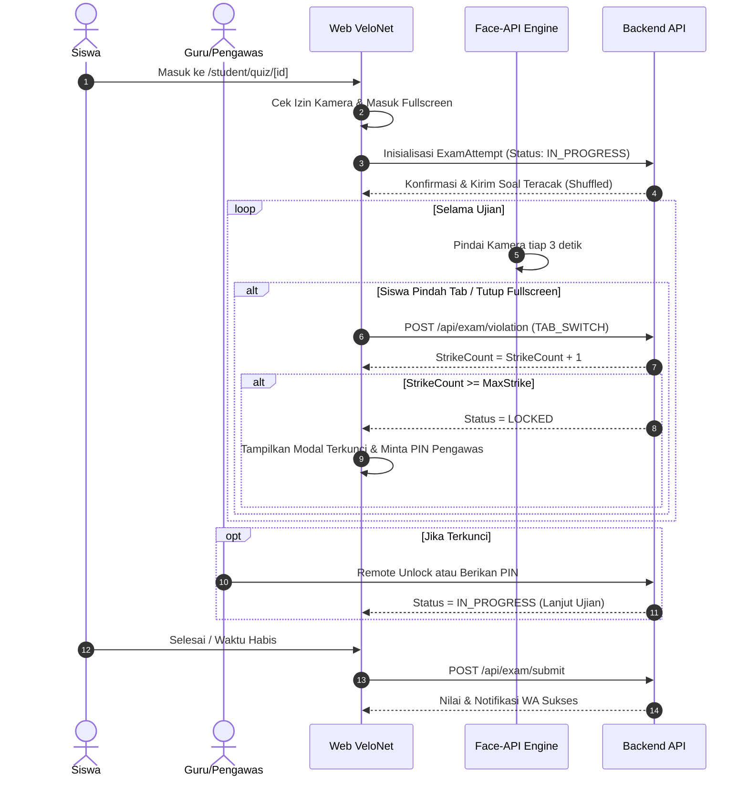

# Dokumen Spesifikasi Teknis: VeloExambro (Sistem CBT Aman & Anti-Kecurangan)

## 1. Ringkasan Eksekutif (Executive Summary)
**VeloExambro** adalah arsitektur keamanan ujian berbasis komputer (*Computer-Based Test / CBT*) untuk **VeloNet LMS** yang dirancang untuk mencegah, mendeteksi, dan memitigasi berbagai bentuk kecurangan peserta selama ujian berlangsung.

Sistem ini mengadopsi pendekatan **Multi-Layer Defense (Pertahanan Berlapis)** yang mencakup:
1. **In-Browser Secure Mode (Web-Based)**: Penguncian antarmuka, deteksi perpindahan tab/aplikasi, pemblokiran *clipboard*, dan pencegahan akses alat pengembang (*DevTools*).
2. **AI Face Proctoring**: Pengawasan visual otomatis menggunakan model *Face Recognition* yang telah terpasang di VeloNet untuk mendeteksi ketiadaan wajah atau kehadiran joki (wajah ganda).
3. **Supervisor Control Room (Live Dashboard)**: Pemantauan real-time bagi mentor/pengawas untuk melihat log pelanggaran, status kamera, dan melakukan *Remote Unlock* atau *Force Submit*.
4. **Dedicated Mobile Kiosk (Android APK)**: Penguncian penuh level sistem operasi (*OS-level lockdown*) untuk memblokir navigasi, *split-screen*, notifikasi, dan tangkapan layar (*screenshot*).

---

## 2. Matriks Ancaman & Solusi Pencegahan (Threat Model)

| Bentuk Kecurangan | Vektor Serangan Siswa | Solusi Pengamanan VeloExambro |
| :--- | :--- | :--- |
| **Buka Tab / Aplikasi Lain** | Beralih ke Google, ChatGPT, atau WhatsApp di browser/HP | `Page Visibility API` + `Window Blur Detection` + Sistem Strike & Auto-Lock |
| **Keluar dari Ujian** | Memperkecil jendela browser (*minimize*) atau split screen | `Fullscreen API Lock` (Wajib layar penuh, keluar = peringatan/kunci) |
| **Salin-Tempel Soal/Jawaban** | Copy teks soal untuk di-*paste* ke AI atau grup chat | Nonaktifkan event `copy`, `paste`, `cut`, `selectstart`, dan `user-select: none` |
| **Inspect Element / DevTools** | Melihat jawaban pada DOM atau memodifikasi timer ujian | Trap `debugger`, deteksi pembukaan DevTools via window size, blokir `F12` / `Ctrl+Shift+I` |
| **Bantuan Joki / Orang Lain** | Teman duduk di sebelah atau menggantikan pengerjaan | **AI Face Proctoring**: Deteksi jika ada >1 wajah atau 0 wajah di kamera |
| **Bagi Layar / Tangkapan Layar** | Screenshot soal atau rekam layar untuk disebarkan | Anti-shortcut printscreen, watermark dinamis (nama + NIM/ID), dan `FLAG_SECURE` di Kiosk APK |
| **Manipulasi Jam / Timer** | Mengubah waktu lokal perangkat agar durasi bertambah | **Server-Side Synced Timer** (validasi durasi mutlak di API backend Prisma) |
| **Saling Contek Antar Siswa** | Melihat urutan jawaban teman di sebelahnya | Randomisasi urutan soal dan opsi jawaban (*Shuffle Engine*) |

---

## 3. Arsitektur Pertahanan Berlapis (Multi-Layer Security)



---

## 4. Rincian Teknis Implementasi

### 4.1 Tier 1: In-Browser Secure Mode (Web Client)

Fitur ini berjalan langsung di browser siswa (Next.js client-side hook: `useExamSecurity`):

#### 1. Fullscreen Enforcement
- Saat menekan tombol "Mulai Ujian", browser mengeksekusi `document.documentElement.requestFullscreen()`.
- Listener `fullscreenchange` aktif sepanjang ujian. Jika siswa menekan tombol `Esc` atau keluar dari fullscreen:
  - Antarmuka langsung menampilkan overlay blur dan dialog peringatan.
  - Nilai *Strike* bertambah +1.

#### 2. Page Visibility & Window Blur Detection
- Memantau event `document.visibilitychange` dan `window.onblur`.
- Jika siswa menekan `Alt+Tab`, membuka tab baru, atau membuka aplikasi WhatsApp/notifikasi:
  - Timestamp waktu keluar dan durasi meninggalkan tab dicatat.
  - Peringatan instan muncul saat siswa kembali: *"Terdeteksi meninggalkan halaman ujian!"*.
  - Menambah poin pelanggaran (*Strike*).

#### 3. Keyboard & Mouse Lockout
- **Shortcut Blocker**:
  ```typescript
  // Memblokir F12, Ctrl+Shift+I, Ctrl+Shift+J, Ctrl+U, Ctrl+C, Ctrl+V, Alt+Tab, PrintScreen
  window.addEventListener("keydown", (e) => {
    if (
      e.key === "F12" ||
      (e.ctrlKey && e.shiftKey && ["I", "J", "C"].includes(e.key.toUpperCase())) ||
      (e.ctrlKey && ["U", "C", "V", "A", "S", "P"].includes(e.key.toUpperCase())) ||
      e.key === "PrintScreen"
    ) {
      e.preventDefault();
      e.stopPropagation();
    }
  });
  ```
- **Context Menu & Selection Lock**:
  - `document.addEventListener('contextmenu', e => e.preventDefault())`
  - CSS global untuk halaman ujian: `user-select: none; -webkit-user-select: none;`

#### 4. Anti-DevTools Debugger Trap
- Menyematkan fungsi *infinite debugger loop* ringan di web worker/interval:
  ```typescript
  setInterval(() => {
    const startTime = performance.now();
    debugger;
    if (performance.now() - startTime > 100) {
      // DevTools sedang terbuka (eksekusi terjeda di debugger)
      handleDevToolsDetected();
    }
  }, 2000);
  ```

---

### 4.2 Tier 2: AI Face Proctoring & Visual Integrity

VeloNet sudah memiliki model AI pendeteksi wajah di direktori `/public/models/` (`ssd_mobilenetv1`, `tiny_face_detector`, `face_landmark_68`).

#### Alur Kerja AI Proctoring:
1. **Camera Pre-Check**: Sebelum soal muncul, siswa wajib mengizinkan akses kamera depan (*Webcam Stream*).
2. **Periodic Face Scan (Tiap 3-5 Detik)**:
   - AI memindai frame video kamera untuk menghitung jumlah wajah yang terdeteksi:
     - **0 Wajah (No Face)**: Siswa meninggalkan tempat duduk / menunduk terlalu lama $\rightarrow$ Trigger warning *"Wajah tidak terdeteksi di kamera!"*.
     - **> 1 Wajah (Multiple Faces)**: Ada orang lain di samping siswa $\rightarrow$ Trigger warning *"Terdeteksi lebih dari 1 orang di layar!"* + Simpan snapshot sebagai bukti pelanggaran.
     - **1 Wajah (Normal)**: Lolos verifikasi.
3. **Random Snapshot Audit**:
   - Sistem secara acak mengambil 3-5 foto selama ujian dan mengunggahnya ke server/database untuk diaudit oleh pengawas setelah ujian selesai.

---

### 4.3 Tier 3: Supervisor Control Room (Live Dashboard Mentor)

Halaman khusus pengawas di `/admin/exams/[examId]/proctor`:
- **Live Student Grid**: Kartu monitoring per peserta yang menampilkan:
  - Nama & Foto Profil Siswa
  - Status Saat Ini (*Mengerjakan*, *Terkunci*, *Selesai*, *Didiskualifikasi*)
  - Jumlah Pelanggaran (*Strike Count*: 0/3)
  - Indikator Kamera & Thumbnail Snapshot Terakhir
  - Soal yang sedang dikerjakan (contoh: *Soal 12 dari 40*)
- **Aksi Pengawas (Mentor Actions)**:
  - **Buka Kunci (Unlock)**: Membuka ujian siswa yang terkunci karena melebihi kuota strike, atau memberikan **PIN/Token Pengawas** yang dimasukkan siswa di layarnya.
  - **Reset Strike**: Menyetel ulang pelanggaran siswa jika terjadi kesalahan teknis yang valid.
  - **Force Submit**: Menghentikan ujian siswa secara paksa dan langsung menilai jawaban yang ada.
  - **Diskualifikasi**: Membatalkan hasil ujian dengan nilai 0 akibat kecurangan berat.

---

### 4.4 Tier 4: Native Exambro App (Android Kiosk Mode)

Untuk ujian berstandar tinggi (misal: Ujian Akhir / Semesteran), VeloNet dapat dibungkus menjadi aplikasi Android Kiosk menggunakan **Capacitor / Native Android**:

1. **Lock Task Mode (Screen Pinning)**:
   - Menonaktifkan tombol navigasi sistem (*Home*, *Back*, *Recent Apps*).
   - Mematikan *Notification Drawer* (panel notifikasi tidak bisa ditarik turun).
2. **Blokir Fitur Multitasking OS**:
   - Mematikan *Split Screen* dan *Floating Window / Picture-in-Picture*.
3. **Pencegahan Screenshot Level OS**:
   - Menambahkan flag native `WindowManager.LayoutParams.FLAG_SECURE` pada Activity Android sehingga tangkapan layar dan perekaman layar menghasilkan layar hitam (*black screen*).
4. **Header Token Verification**:
   - Aplikasi Exambro menyertakan secret header khusus (misal: `x-velonet-exambro-signature`).
   - Server menolak akses jika ujian disetel berstatus `requiresApp: true` tetapi dibuka via browser biasa.

---

## 5. Usulan Perubahan Skema Database (Prisma)

Untuk mendukung VeloExambro, model Prisma berikut ditambahkan ke `prisma/schema.prisma`:

```prisma
// Pengaturan Keamanan Kuis / Ujian
model QuizSecurityConfig {
  id                    String   @id @default(cuid())
  quizId                String   @unique
  quiz                  Quiz     @relation(fields: [quizId], references: [id], onDelete: Cascade)
  
  enableFullscreenLock  Boolean  @default(true)
  enableTabSwitchDetect Boolean  @default(true)
  maxStrikes            Int      @default(3)
  enableCameraProctor   Boolean  @default(true)
  requireExambroApp     Boolean  @default(false)
  supervisorPin         String   @default("123456")
  shuffleQuestions      Boolean  @default(true)
  shuffleOptions        Boolean  @default(true)
  
  createdAt             DateTime @default(now())
  updatedAt             DateTime @updatedAt
}

// Rekam Jejak Pengerjaan Ujian Siswa
model ExamAttempt {
  id              String             @id @default(cuid())
  quizId          String
  quiz            Quiz               @relation(fields: [quizId], references: [id], onDelete: Cascade)
  participantId   String
  participant     Participant        @relation(fields: [participantId], references: [id], onDelete: Cascade)
  
  status          ExamStatus         @default(IN_PROGRESS) // IN_PROGRESS, LOCKED, SUBMITTED, DISQUALIFIED
  strikeCount     Int                @default(0)
  startedAt       DateTime           @default(now())
  submittedAt     DateTime?
  score           Float?
  
  violations      ExamViolationLog[]
  snapshots       ExamSnapshot[]
  
  createdAt       DateTime           @default(now())
  updatedAt       DateTime           @updatedAt

  @@unique([quizId, participantId])
}

enum ExamStatus {
  IN_PROGRESS
  LOCKED
  SUBMITTED
  DISQUALIFIED
}

// Log Detail Setiap Pelanggaran
model ExamViolationLog {
  id            String          @id @default(cuid())
  attemptId     String
  attempt       ExamAttempt     @relation(fields: [attemptId], references: [id], onDelete: Cascade)
  
  type          ViolationType
  description   String?
  snapshotUrl   String?
  timestamp     DateTime        @default(now())
}

enum ViolationType {
  TAB_SWITCH
  FULLSCREEN_EXIT
  DEVTOOLS_OPENED
  MULTIPLE_FACES
  NO_FACE_DETECTED
  UNAUTHORIZED_KEYPRESS
}

// Audit Foto Snapshot Berkala / Bukti Pelanggaran
model ExamSnapshot {
  id            String       @id @default(cuid())
  attemptId     String
  attempt       ExamAttempt  @relation(fields: [attemptId], references: [id], onDelete: Cascade)
  
  imageUrl      String
  faceCount     Int          @default(1)
  capturedAt    DateTime     @default(now())
}
```

---

## 6. Desain Alur Pengguna (UI/UX Flow)

Sesuai aturan mutlak di `AGENTS.md`, seluruh antarmuka 100% responsif mobile dan menggunakan `DialogProvider` (`useDialog()`):



---

## 7. Rencana Roadmap Implementasi (Implementation Roadmap)

### Fase 1: Fondasi In-Browser Anti-Cheat (Sprint 1)
- [ ] Buat custom hook `useExamSecurity` (Fullscreen Lock, Tab Switch, Key/Clipboard Blocker).
- [ ] Implementasikan sistem peringatan dan modal dialog berbasis `useDialog()`.
- [ ] Buat mekanisme Strike Counter dan layar penguncian (*Lock Screen*).
- [ ] Buat API endpoint pencatatan pelanggaran (`/api/exam/violation`) dan buka kuncian via PIN (`/api/exam/unlock`).

### Fase 2: Integrasi AI Face Proctoring (Sprint 2)
- [ ] Integrasikan modul `@vladmandic/face-api` pada komponen kamera pengerjaan kuis.
- [ ] Tambahkan verifikasi pra-ujian (deteksi 1 wajah sebelum tombol start aktif).
- [ ] Jalankan interval proctoring latar belakang (deteksi 0 wajah atau >1 wajah).
- [ ] Buat fitur capture snapshot otomatis ke direktori upload/database saat terjadi pelanggaran.

### Fase 3: Dashboard Live Proctoring Mentor (Sprint 3)
- [ ] Buat antarmuka pengawas `/admin/exams/[id]/proctor` dengan auto-refresh / SSE.
- [ ] Sediakan tombol aksi cepat: *Unlock Student*, *Reset Strike*, *Force Submit*, dan *Lihat Snapshot*.
- [ ] Tambahkan rekap analitik integritas pada laporan nilai siswa.

### Fase 4: Aplikasi Mobile Kiosk (Opsional - Sprint 4)
- [ ] Konfigurasi Capacitor Android wrapper untuk VeloNet.
- [ ] Aktifkan `FLAG_SECURE` dan Kiosk Lock Task Mode di Android.
- [ ] Terapkan validasi `x-velonet-exambro-signature` pada backend.

---

## 8. Kesimpulan
Dengan arsitektur **VeloExambro** ini, VeloNet tidak hanya memiliki sistem kuis biasa, tetapi menjadi **platform CBT berstandar tinggi yang setara dengan aplikasi Exambro resmi (ANBK/UTBK)** dengan keunggulan tambahan berupa **AI Face Proctoring langsung di browser** tanpa membebani siswa dengan instalasi yang rumit.
